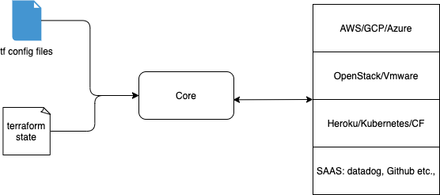

## Terraform

#### What Terraform does and how can I use terraform
helps the operator in writing infrastructure as a code that enables him in provisioning infrastructure resource in a easier form using terraform scripts than manually configuring them using IAAS specific console. 
It can provision cloud resources such as VMs, LBs etc and is cloud agnostic (i.e., terraform scripts can be used to provision resources in most cloud providers)

#### How can I use terraform
- Provision GCP resources such as VMs, Loadbalancers 
- Build multi-tier app components such as web servers, databases, cache resources etc., 
- Build disposable environments - create perf test env, test load and destroy components.
- Build container orchestration env such as Kubernetes
- Multi-cloud deployment - help operators in building infrastructures that can be deployed on any IAAS.

More about terraform - concepts, how it works, components, terminologies and overview - [here](overview/readme.sh)

#### How it works
</img>

[CLI Cheatsheet](CLI/readme.md)
 : 
_Terraform knows about the infrastructure, talks to the IAAS and destroys all components and cleans up._    

### Get started with Terraform samples
* [Simple - Compute instance creation](samples/basics/readme.md)
* [Kubernetes-cluster](samples/gke/readme.md) 

