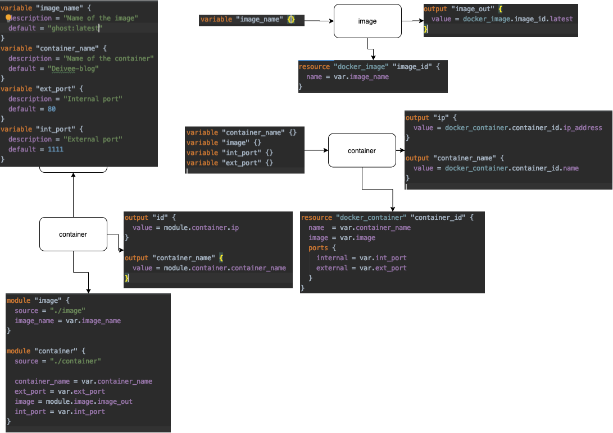

## Terraform

#### What Terraform does
are ways by which an operator manages build and deployment of infrastructure resource in a easier form using terraform scripts than manually configuring them using IAAS specific console. 

It can provision cloud resources such as VMs, LBs etc and is cloud agnostic (i.e., terraform scripts can be used to provision resources in most cloud providers)

#### Advantages:
- Ability to automate infrastructure components and destroy them easier by running scripts.

#### How it works
</img>

### How it works

Operator creates the following files
terraform configuration files - main, variables etc., 

Operator runs the following commands
* terraform refresh: 
_terraform gets up to date view of the infrastructure_

* terraform plan: 
_terraform talks to the IAAS provider and identifies what it needs to do (Desired configuration_

* terraform apply: 
_Terraform applies the changes to arrive at the desired state._

* terraform destroy: 
_Terraform knows about the infrastructure, talks to the IAAS and destroys all components and cleans up. _    
#### What happens behind the scene. 

Terraform samples
* [Simple - Compute instance creation](basics/readme.md)
* [Kubernetes-cluster](gke/readme.md) 

### Modules
Terraform uses reusable resources called as modules as part of the script to provision resources. 

</img>

